# Armor Architecture
{: .fs-8 }

Comprehensive system architecture showing all components, services, and data flows.
{: .fs-6 .fw-300 }

---

## System Overview

Armor is an enterprise-grade file management system built with a modern microservices-style architecture. The system provides secure file operations, real-time collaboration, and comprehensive API access through multiple authentication methods.

## Detailed Architecture Diagram

```mermaid
graph TB
    subgraph "Client Layer"
        WB[Web Browser<br/>React SPA<br/>Progressive Web App]
        CLI[CLI Tools<br/>wget/curl<br/>HTTP Basic Auth]
        API[API Clients<br/>Third-party Apps<br/>Bearer Token Auth]
        MOBILE[Mobile Devices<br/>Responsive Interface]
    end
    
    subgraph "Load Balancer & SSL"
        LB[Load Balancer<br/>HTTPS Termination]
        SSL[SSL Manager<br/>Auto-generation<br/>Certificate Management]
    end
    
    subgraph "Authentication & Authorization"
        AUTH{Authentication<br/>Middleware<br/>Multi-method Support}
        JWT[JWT Sessions<br/>Web Interface<br/>Cookie-based]
        APIKEY[API Keys<br/>Bearer Tokens<br/>Scoped Permissions]
        BASIC[HTTP Basic Auth<br/>CLI Compatible<br/>wget/curl Support]
        OIDC[OIDC Providers<br/>Google/GitHub/Enterprise<br/>SSO Integration]
        RBAC[Role-Based Access<br/>Downloads/Uploads/Delete<br/>Permission Matrix]
    end
    
    subgraph "Armor Server Core"
        EXPRESS[Express.js Server<br/>HTTPS/HTTP<br/>Port Configuration]
        SECURITY[Security Middleware<br/>Helmet/CORS/CSRF<br/>Rate Limiting/CSP]
        ROUTER[Route Handlers<br/>REST API Endpoints<br/>File Operations]
        VALIDATION[Input Validation<br/>Path Security<br/>Upload Sanitization]
    end
    
    subgraph "Real-time Communication System"
        SSE[Server-Sent Events<br/>Live Updates<br/>Multi-client Broadcast]
        EVENTS[Event Broadcasting<br/>File Operations<br/>Checksum Progress]
        WSMANAGER[WebSocket Manager<br/>Connection Handling<br/>Client Tracking]
    end
    
    subgraph "Background Processing Services"
        FILEWATCHER[File Watcher Service<br/>Chokidar Integration<br/>Real-time FS Monitoring<br/>Change Detection]
        CHECKSUM[Checksum Service<br/>SHA256 Calculation<br/>Worker Pool Management<br/>Progress Tracking]
        MAINTENANCE[Maintenance Service<br/>Database Optimization<br/>Cleanup Operations<br/>Performance Tuning]
        CACHE[Cache Service<br/>Directory Listings<br/>Performance Optimization<br/>Memory Management]
        BATCHOPS[Batch Operations<br/>Database Upserts<br/>Bulk Processing<br/>Performance Optimization]
    end
    
    subgraph "Data Persistence Layer"
        DB[(Database Layer<br/>SQLite/PostgreSQL/MySQL<br/>Sequelize ORM<br/>Connection Pooling)]
        DBMETA[File Metadata<br/>Checksums/Timestamps<br/>Directory Structure<br/>User Associations]
        APIKEYS[API Key Storage<br/>Encrypted Keys<br/>Permission Matrix<br/>Expiration Management]
        USERS[User Management<br/>Local Users<br/>OIDC Mappings<br/>Permission Inheritance]
    end
    
    subgraph "File System Layer"
        FS[Secure File System<br/>Directory Serving<br/>Path Validation<br/>Access Control]
        UPLOAD[Upload Handler<br/>Multer Integration<br/>File Validation<br/>Temporary Processing]
        STATIC[Static Content<br/>Custom index.html<br/>Theme Assets<br/>PWA Resources]
    end
    
    subgraph "Configuration & Localization"
        CONFIG[Configuration System<br/>YAML-based<br/>Environment Variables<br/>Runtime Reload]
        I18N[Internationalization<br/>Multi-language Support<br/>Auto-detection<br/>Locale Fallbacks]
        LOGGING[Centralized Logging<br/>Winston Integration<br/>Multiple Transports<br/>Log Rotation]
    end
    
    subgraph "Frontend Architecture"
        REACT[React Application<br/>Single Page App<br/>Client-side Routing]
        COMPONENTS[Component Library<br/>File Management UI<br/>Upload Components<br/>Search Interface]
        HOOKS[Custom Hooks<br/>SSE Integration<br/>File Operations<br/>Authentication State]
        PWA[Progressive Web App<br/>Service Worker<br/>Offline Capabilities<br/>Push Notifications]
        SWAGGER[Swagger UI Integration<br/>API Documentation<br/>Live Testing<br/>Dark Theme]
    end
    
    subgraph "API Documentation System"
        APIDOCS[API Documentation<br/>OpenAPI 3.0<br/>Auto-generation<br/>Interactive Testing]
        DOCGEN[Documentation Generation<br/>Static Site Generation<br/>GitHub Pages<br/>Jekyll Integration]
    end
    
    %% Client connections with protocols
    WB -.->|HTTPS/WSS<br/>Modern Browsers| LB
    CLI -.->|HTTPS + Basic Auth<br/>wget/curl Compatible| LB
    API -.->|HTTPS + Bearer Token<br/>RESTful API| LB
    MOBILE -.->|HTTPS/Responsive<br/>Mobile Optimized| LB
    
    %% Load balancing and SSL
    LB --> SSL
    SSL --> EXPRESS
    
    %% Authentication flow
    EXPRESS --> SECURITY
    SECURITY --> AUTH
    AUTH --> JWT
    AUTH --> APIKEY
    AUTH --> BASIC
    AUTH --> OIDC
    AUTH --> RBAC
    
    %% Core server processing
    EXPRESS --> VALIDATION
    VALIDATION --> ROUTER
    ROUTER --> FILEWATCHER
    ROUTER --> UPLOAD
    
    %% Real-time communication
    ROUTER --> SSE
    SSE --> EVENTS
    EVENTS --> WSMANAGER
    WSMANAGER -.->|Live Updates<br/>Multi-user Sync| WB
    WSMANAGER -.->|Progress Updates<br/>Real-time Status| MOBILE
    
    %% Background services orchestration
    FILEWATCHER --> BATCHOPS
    BATCHOPS --> CHECKSUM
    CHECKSUM --> MAINTENANCE
    MAINTENANCE --> CACHE
    
    %% Event propagation
    FILEWATCHER --> EVENTS
    CHECKSUM --> EVENTS
    UPLOAD --> EVENTS
    
    %% Data layer interactions
    ROUTER --> DB
    FILEWATCHER --> DBMETA
    CHECKSUM --> DBMETA
    AUTH --> APIKEYS
    AUTH --> USERS
    BATCHOPS --> DB
    
    %% File system operations
    ROUTER --> FS
    UPLOAD --> FS
    FS --> STATIC
    FS --> FILEWATCHER
    
    %% Configuration and localization
    CONFIG --> EXPRESS
    CONFIG --> AUTH
    CONFIG --> FILEWATCHER
    CONFIG --> I18N
    CONFIG --> LOGGING
    I18N --> ROUTER
    LOGGING --> EXPRESS
    
    %% Frontend architecture
    WB --> REACT
    REACT --> COMPONENTS
    COMPONENTS --> HOOKS
    HOOKS --> PWA
    REACT --> SWAGGER
    
    %% API documentation
    ROUTER --> APIDOCS
    APIDOCS --> DOCGEN
    DOCGEN -.->|Static Generation| SWAGGER
    
    %% Database relationships
    DB --> DBMETA
    DB --> APIKEYS
    DB --> USERS
    
    classDef client fill:#1f2937,stroke:#3b82f6,stroke-width:2px,color:#f9fafb
    classDef loadbalancer fill:#065f46,stroke:#10b981,stroke-width:2px,color:#f0fdf4
    classDef auth fill:#581c87,stroke:#a855f7,stroke-width:2px,color:#faf5ff
    classDef server fill:#0f172a,stroke:#06b6d4,stroke-width:2px,color:#f0f9ff
    classDef realtime fill:#92400e,stroke:#f59e0b,stroke-width:2px,color:#fffbeb
    classDef services fill:#14532d,stroke:#22c55e,stroke-width:2px,color:#f0fdf4
    classDef data fill:#7c2d12,stroke:#ef4444,stroke-width:2px,color:#fef2f2
    classDef filesystem fill:#1e293b,stroke:#64748b,stroke-width:2px,color:#f8fafc
    classDef config fill:#4c1d95,stroke:#8b5cf6,stroke-width:2px,color:#f5f3ff
    classDef frontend fill:#0c4a6e,stroke:#0ea5e9,stroke-width:2px,color:#f0f9ff
    classDef docs fill:#166534,stroke:#16a34a,stroke-width:2px,color:#f0fdf4
    
    class WB,CLI,API,MOBILE client
    class LB,SSL loadbalancer
    class AUTH,JWT,APIKEY,BASIC,OIDC,RBAC auth
    class EXPRESS,SECURITY,ROUTER,VALIDATION server
    class SSE,EVENTS,WSMANAGER realtime
    class FILEWATCHER,CHECKSUM,MAINTENANCE,CACHE,BATCHOPS services
    class DB,DBMETA,APIKEYS,USERS data
    class FS,UPLOAD,STATIC filesystem
    class CONFIG,I18N,LOGGING config
    class REACT,COMPONENTS,HOOKS,PWA,SWAGGER frontend
    class APIDOCS,DOCGEN docs
```

## Component Details

### Client Layer
- **Web Browser**: React SPA with real-time SSE integration
- **CLI Tools**: Full compatibility with wget, curl, and similar tools
- **API Clients**: RESTful API access with Bearer token authentication
- **Mobile Devices**: Responsive interface optimized for mobile access

### Authentication & Authorization
- **Multi-method Authentication**: Supports JWT sessions, API keys, and HTTP Basic Auth
- **OIDC Integration**: Enterprise SSO with Google, GitHub, and custom providers
- **Role-based Access Control**: Granular permissions (downloads, uploads, delete)
- **API Key Management**: Scoped permissions with expiration and usage tracking

### Server Core
- **Express.js**: High-performance web server with comprehensive middleware
- **Security Middleware**: Helmet, CORS, CSRF protection, and rate limiting
- **Input Validation**: Path security and upload sanitization
- **Route Handlers**: RESTful API endpoints with comprehensive error handling

### Real-time System
- **Server-Sent Events**: Live updates for file operations and progress
- **Event Broadcasting**: Multi-client synchronization system
- **WebSocket Management**: Connection handling and client state tracking

### Background Services
- **File Watcher**: Real-time file system monitoring with Chokidar
- **Checksum Service**: SHA256 calculation with worker pool management
- **Maintenance Service**: Database optimization and cleanup operations
- **Cache Service**: Performance optimization for directory listings
- **Batch Operations**: Optimized database operations for high throughput

### Data Layer
- **Multi-database Support**: SQLite (default), PostgreSQL, MySQL
- **File Metadata**: Comprehensive tracking of checksums, timestamps, and structure
- **API Key Storage**: Encrypted key storage with permission management
- **User Management**: Local and OIDC user integration

### File System
- **Secure Serving**: Path validation and access control
- **Upload Processing**: Multer integration with validation and processing
- **Static Content**: Support for custom index.html and theme assets

### Configuration & Internationalization
- **YAML Configuration**: Flexible, environment-aware configuration system
- **Multi-language Support**: Auto-detected locales with fallback support
- **Centralized Logging**: Winston-based logging with rotation and multiple transports

### Frontend Architecture
- **React SPA**: Modern single-page application with client-side routing
- **Component Library**: Comprehensive UI components for file management
- **Custom Hooks**: SSE integration and file operation abstractions
- **Progressive Web App**: Service worker support with offline capabilities
- **Integrated Swagger UI**: API documentation and testing interface

---

**[Back to Home](../)**
