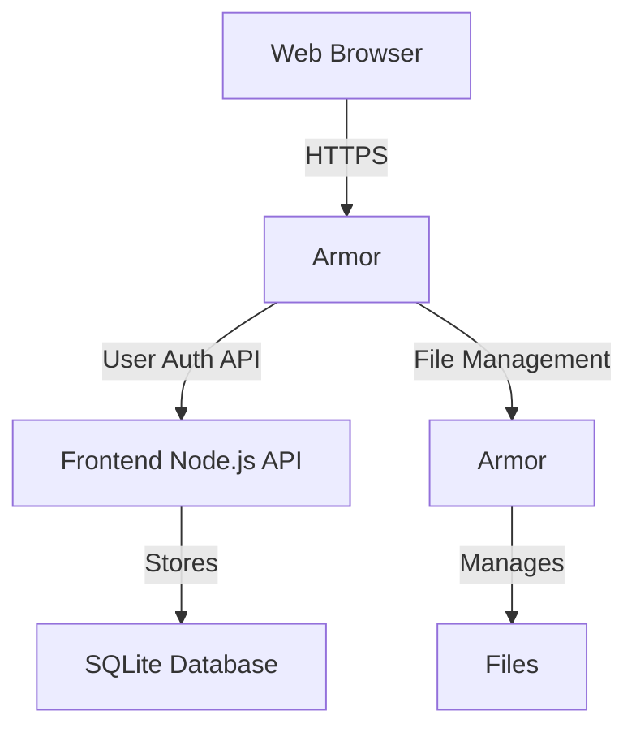

# Armor Documentation
{: .fs-9 }

React-based web frontend for Armor file management, Provides user management.
{: .fs-6 .fw-300 }

[Get started now](#getting-started){: .btn .btn-primary .fs-5 .mb-4 .mb-md-0 .mr-2 }
[View API Reference](docs/api/){: .btn .fs-5 .mb-4 .mb-md-0 }
[View on GitHub](https://github.com/STARTcloud/armor_private){: .btn .fs-5 .mb-4 .mb-md-0 }

---

## Getting started

Armor is a api drive file management system with OIDC and local Auth

### Key Features

- **User Management**: Complete user authentication and authorization system
- **Multi-Organization Support**: Organization-based access control and management
- **Server Management**: Configure and manage multiple Armor API connections
- **Web Interface**: Modern React-based dashboard -- not yet, just kidding
- **API Integration**: RESTful API for user management
- **Responsive Design**: Mobile-friendly interface for on-the-go management

### Architecture

### Quick start

1. **Installation**: Install Armor via package or build from source
2. **Configuration**: Configure settings in `/etc/armor/config.yaml`
3. **Setup**: Create initial organization and admin user
4. **Backend Connection**: Configure Armor API server connections
5. **Access**: Open web interface

### Documentation

The Armor provides comprehensive documentation:

- **[API Reference](docs/api/)** - Frontend API for user/organization management
- **[Getting Started Guide](docs/guides/getting-started/)** - Step-by-step setup instructions  
- **[Installation Guide](docs/guides/installation/)** - Installation and deployment
- **[User Guide](docs/user-guide/)** - Web interface usage and features
- **[Backend Integration](docs/guides/backend-integration/)** - Connecting to Armor API API

---

## About the project

Armor is &copy; 2025 by the Armor Project.

### License

Armor is distributed by an [GPL-3.0 license](https://github.com/STARTcloud/armor_private/blob/main/LICENSE.md).

### Contributing

When contributing to this repository, please first discuss the change you wish to make via issue, email, or any other method with the owners of this repository before making a change. Read more about becoming a contributor in [our GitHub repo](https://github.com/STARTcloud/armor_private#contributing).

#### Thank you to the contributors of Armor!

<ul class="list-style-none">

  <li class="d-inline-block mr-1">
     
  </li>

</ul>

### Code of Conduct

Armor is committed to fostering a welcoming community.

[View our Code of Conduct](https://github.com/STARTcloud/armor_private/tree/main/CODE_OF_CONDUCT.md) on our GitHub repository.
